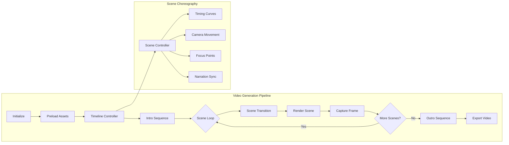
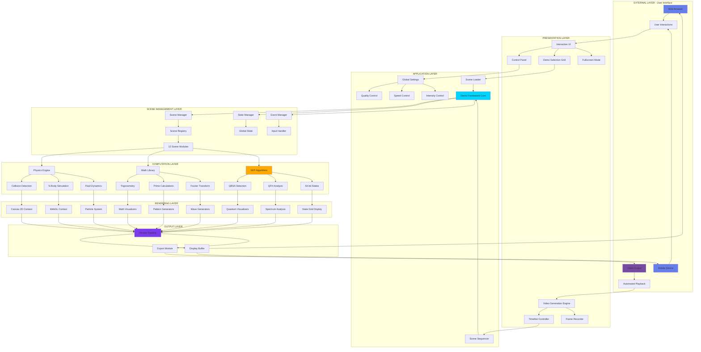
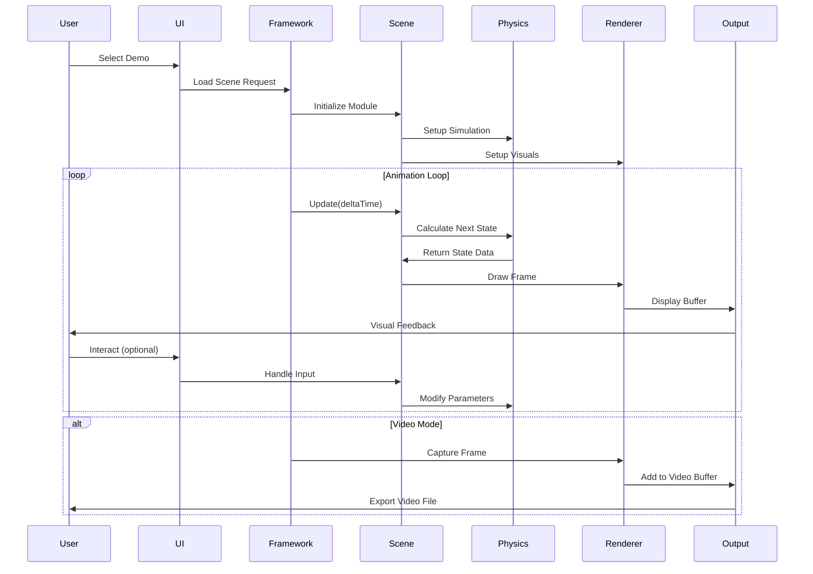
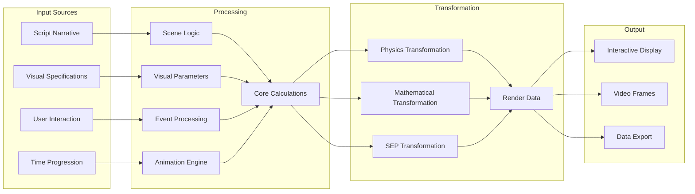

## SEP Interactive Demos Platform - Overhaul Framework

### Current State Analysis

You have:
1. **Two demo implementations**: 
   - `sep_interactive_demos.html` (monolithic, 12 scenes partially implemented)
   - `demos.html` with modular framework (2 of 12 scenes implemented)
2. **Script alignment**: 12 scenes in `scriptv1.md` that need visual representation
3. **Outline specifications**: Detailed visual requirements for each scene in `outline.md`

### Framework Document 1: Interactive Platform Overhaul

Here's the comprehensive framework for the interactive overhaul:

```mermaid
graph TB
    subgraph "User Experience Layer"
        UI[Interactive UI]
        VideoMode[Video Mode]
        DemoMode[Demo Mode]
        Controls[Unified Controls]
    end
    
    subgraph "Demo Engine"
        Framework[Demo Framework]
        SceneManager[Scene Manager]
        AnimationLoop[Animation Engine]
        StateManager[State Manager]
    end
    
    subgraph "Content Layer - 12 Scenes"
        S1[Scene 1: Wave Interference]
        S2[Scene 2: Angle Classification]
        S3[Scene 3: Cosine Alignment]
        S4[Scene 4: Sine Deviation]
        S5[Scene 5: Three-Body Problem]
        S6[Scene 6: Pi Emergence]
        S7[Scene 7: Prime Spiral]
        S8[Scene 8: Flocking]
        S9[Scene 9: SEP Framework]
        S10[Scene 10: Fluid Dynamics]
        S11[Scene 11: Black-Scholes]
        S12[Scene 12: Meta-Visualization]
    end
    
    subgraph "Rendering Layer"
        Canvas[HTML5 Canvas]
        WebGL[WebGL Context]
        Physics[Physics Engine]
        Particles[Particle System]
    end
    
    UI --> Framework
    Framework --> SceneManager
    SceneManager --> S1
    SceneManager --> S2
    SceneManager --> S3
    SceneManager --> S4
    SceneManager --> S5
    SceneManager --> S6
    SceneManager --> S7
    SceneManager --> S8
    SceneManager --> S9
    SceneManager --> S10
    SceneManager --> S11
    SceneManager --> S12
    
    AnimationLoop --> Canvas
    AnimationLoop --> WebGL
    Physics --> Particles
```



### Interactive Overhaul Strategy

#### 1. **Unified Architecture**
- Migrate from dual systems to single modular framework
- Implement all 12 scenes as ES6 modules
- Create shared physics/rendering utilities

#### 2. **Enhanced Interactivity**
Each scene will have:
- **Mouse/Touch interactions**: Direct manipulation of parameters
- **Real-time feedback**: Visual indicators showing mathematical relationships
- **Progressive disclosure**: Start simple, reveal complexity through interaction
- **Educational overlays**: Optional explanations tied to script concepts

#### 3. **Scene-Specific Implementations**

**Scenes 1-4: Trigonometric Foundations**
- Wave interference with Fourier decomposition
- Interactive angle classification with real-time cosine values
- Billiard collision physics with energy transfer visualization
- Tangent explosion with boundary enforcement

**Scenes 5-8: Complex Systems**
- Three-body gravity simulation with perspective switching
- Pi calculation through collisions with digit emergence
- Prime spiral with trajectory mapping
- Flocking with trigonometric coherence rules

**Scenes 9-12: SEP Framework**
- 64-bit quantum state visualization
- Fluid dynamics with vorticity
- Financial derivatives with SEP optimization
- Meta-visualization combining all elements

### Framework Document 2: Standalone Animation Flow



### Video Animation Specifications

#### **Automated Scene Flow**
```javascript
const sceneTimeline = [
    { id: 1, duration: 45, transition: 'fade', focus: 'wave_peaks' },
    { id: 2, duration: 40, transition: 'morph', focus: 'angle_arc' },
    { id: 3, duration: 50, transition: 'zoom', focus: 'collision_point' },
    { id: 4, duration: 35, transition: 'rotate', focus: 'tangent_explosion' },
    { id: 5, duration: 60, transition: 'pan', focus: 'orbital_paths' },
    { id: 6, duration: 45, transition: 'dissolve', focus: 'collision_count' },
    { id: 7, duration: 40, transition: 'spiral', focus: 'prime_pattern' },
    { id: 8, duration: 50, transition: 'flock', focus: 'emergent_behavior' },
    { id: 9, duration: 55, transition: 'quantum', focus: 'state_grid' },
    { id: 10, duration: 45, transition: 'flow', focus: 'vortex_center' },
    { id: 11, duration: 40, transition: 'chart', focus: 'efficiency_comparison' },
    { id: 12, duration: 70, transition: 'unify', focus: 'all_elements' }
];
```

#### **Camera Choreography**
- Smooth bezier curves between focus points
- Dynamic zoom based on scene complexity
- Rotation to highlight 3D elements
- Particle trails following camera movement

#### **Visual Narrative Elements**
1. **Consistent color language**: 
   - Acute/coherent = cyan (#00d4ff)
   - Right/boundary = orange (#ffaa00)
   - Obtuse/divergent = purple (#7c3aed)

2. **Progressive complexity**:
   - Start with single elements
   - Build to multi-body interactions
   - Culminate in unified system

3. **Mathematical annotations**:
   - Floating equations at key moments
   - Visual representation of formulas
   - Real-time calculation displays

### Implementation Priorities

1. **Phase 1: Core Framework** (Week 1)
   - Unify architecture
   - Implement scene loading system
   - Create shared utilities

2. **Phase 2: Scene Implementation** (Weeks 2-3)
   - Complete all 12 scenes
   - Add interactivity
   - Implement physics simulations

3. **Phase 3: Video System** (Week 4)
   - Build timeline controller
   - Implement camera system
   - Add export functionality

4. **Phase 4: Polish & Deploy** (Week 5)
   - Performance optimization
   - Mobile responsiveness
   - Documentation

### Technical Stack Recommendations

- **Rendering**: Canvas 2D for simple scenes, WebGL for complex
- **Physics**: Matter.js for 2D, custom integration for specific behaviors
- **Animation**: GSAP for smooth transitions
- **Video Export**: Canvas recording API or headless browser automation
- **Build System**: Vite for fast development and optimized production builds

### Project Management


### Information Flow Diagram



### Data Flow Architecture

