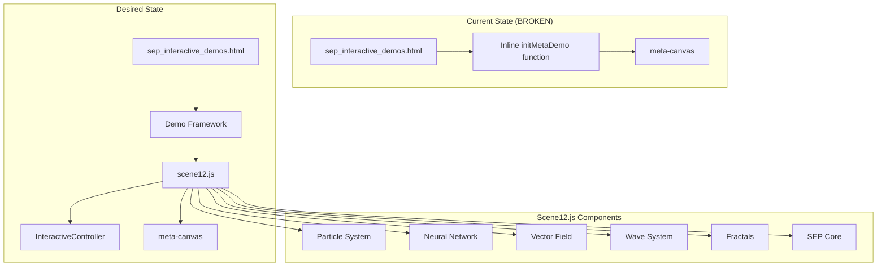
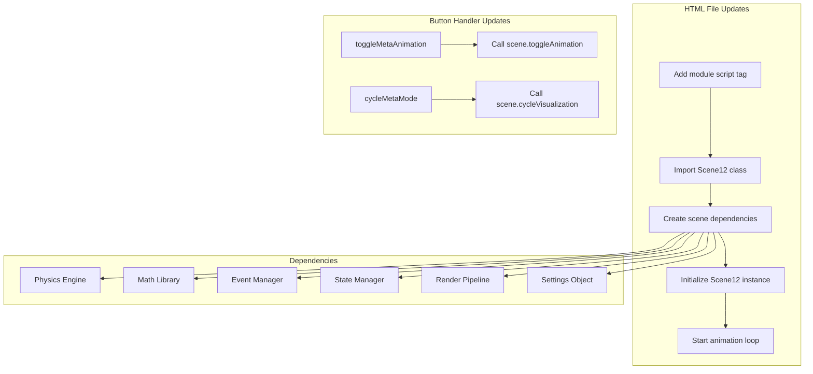

Based on my investigation, I've identified the core issue with Scene 12 not loading properly on your live site. Let me create a comprehensive plan to fix this.

## Problem Analysis

### Current Situation:

1. **Two Different Implementations**: Scene 12 has two completely different implementations:
   - An inline simple implementation in `sep_interactive_demos.html` (the `initMetaDemo()` function)
   - A complex, full-featured implementation in `assets/js/demos/scenes/scene12.js`

2. **The Issue**: The HTML page is using the simple inline version instead of the proper scene12.js file that contains:
   - Interactive controls
   - Particle systems
   - Neural networks
   - Vector fields
   - Wave systems
   - Fractals
   - SEP core visualization

3. **Why It Appears Broken**: The live site is showing a basic rotating visualization instead of the complex unified system you've built in scene12.js.

## Architecture Overview

## Proposed Solution

### Option 1: Integrate with Framework (Recommended)
Update sep_interactive_demos.html to use a proper framework loader that imports scene modules dynamically.

## Implementation Plan
## Detailed Implementation Plan

### Approach: Direct Module Integration

Since the HTML file uses inline JavaScript functions for each demo, I recommend updating the Scene 12 implementation to properly load and use the scene12.js module. Here's how:

### Step-by-Step Fix:

1. **Add Module Script Tag**
   - Add a script tag with `type="module"` to enable ES6 imports
   - Import the Scene12 class from the external file

2. **Replace Inline Function**
   - Replace the simple `initMetaDemo()` with proper Scene12 initialization
   - Create necessary dependencies (physics, math, eventManager, etc.)

3. **Update Button Handlers**
   - Modify `toggleMetaAnimation()` and `cycleMetaMode()` to interact with the Scene12 instance
   - Ensure proper method calls on the scene object

### Code Structure:

### Potential Issues to Address:

1. **Import Paths**: Ensure all relative paths work correctly from the HTML file location
2. **Missing Dependencies**: The InteractiveController and other dependencies must be accessible
3. **Canvas Context**: Make sure the canvas element is properly passed to the Scene12 constructor
4. **Animation Loop**: Implement proper requestAnimationFrame loop to call scene.animate()

